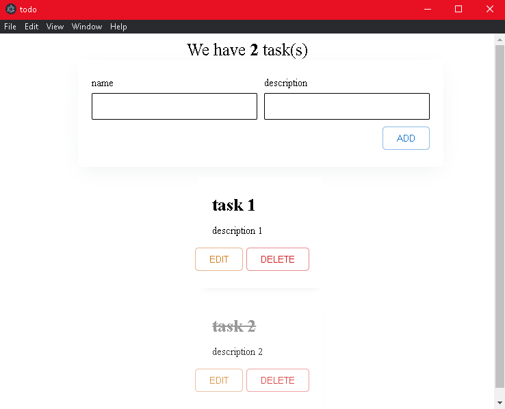

# Проект: Desktop todo приложение

## Оглавление
- [О проекте](#о-проекте)
- [Функционал](#функционал)

## О проекте

Проект todo с использованием Electron - это простое desktop todo приложение, разработанное с использованием React, Electron, TypeScript. Этот проект предоставляет удобный и простой todo list, легко масштабируемый. 

### Основные особенности

- **React**: Проект использует React, благодаря которому отдельные компоненты можно переиспользовать в других проектах или же масштабировать этот. 
- **TypeScript**: Благодаря строгой типизации становится легче понимать код и управлять самим проектом.
- **Electron**: Проект использует Electron -  фреймворк для разработки настольных приложений с использованием HTML, CSS и JavaScript. Такие приложения могут работать на различных платформах. Среди них — Windows, Mac и Linux..

[Ссылка на Electron](https://www.electronjs.org/)

### Функционал

- Добавление задач
- Удаление задач
- Редактирование созданных задач
